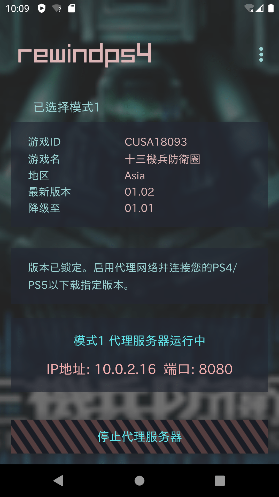

 

## Introduction
This Android app creates a proxy server that allows your PS4/PS5 to connect and download specific versions of PS4 games, which allows you to downgrade your games. Since games are often updated, some content may change over time. This tool enables you to play earlier versions of your games.

* A [Windows version](https://github.com/Ailyth99/RewindPS4) is also available

#### Important Notes
* This program works for downloading PS4 games on both PS4 and PS5 consoles. It does **NOT** work for PS5 games.
* This program is **NOT** a jailbreak method. You do not need to modify your console in any way.

## How to use
* [Download the APK](https://github.com/Ailyth99/RewindPS4_Android/releases) and install it on your Android phone. Requires Android 6.0 or higher.
* The usage method is the same as the Windows version, so you can refer to this guide: [Complete Guide](https://foggy-bath-a54.notion.site/RewindPS4-Guide-ENGLISH-9ffe30e6e07a4077bc63b9c3511e458c?pvs=25)
* Choose and input the json link corresponding to the version you want, or block the update server to download version 1.0. 
* 

## Screenshots
* Support menus in three languages: EN/JA/ZH 

## Libraries Used
* [goproxy](https://github.com/elazarl/goproxy) for build basic proxy server functionality

## Fonts
* IBM Plex Sans-JP regular
* Rajdhani Medium
* 東亜重工フォント
